# RISK – Jeu de stratégie (Java, Console)

Implémentation console du jeu RISK avec gestion des tours, des phases (renforts, attaques, déplacements), attribution des pays et affichage en console.

## Taches réalisées

- Boucle de jeu multi-joueurs et gestion des tours.
- Implémentation des phases de Renforts, Attaque et Déplacement avec les validations de base.
- Interface console robuste avec validation des entrées utilisateur.
- Affichage dynamique de la carte et des informations du tour.

## Fonctionnalités

- **Gestion de Partie** : Supporte des parties de 2 à 5 joueurs avec saisie personnalisée des noms.
- **Cycle de Jeu Complet** : Implémentation de la boucle de jeu principale avec gestion des tours.
- **Phases de Jeu Détaillées** :
  - **Renforts** : Calcul et distribution automatique des troupes en début de tour.
  - **Attaque** : Mécanique de combat complète, incluant la validation des règles (voisinage, nombre de troupes minimum) et la résolution des lancers de dés.
  - **Déplacement** : Mouvement stratégique des troupes entre territoires alliés en fin de tour.

- **Interface Console Interactive** : Un affichage clair de la carte du monde, des informations du tour et des actions possibles, avec des codes couleur pour différencier les joueurs.

## Architecture (résumé et simple)

Le projet est organisé en trois packages principaux, suivant une séparation claire des responsabilités :

- `pf.yozzman.risk.model` : Contient les classes de données qui représentent l'état du jeu (`Joueur`, `Pays`, `Carte`, `Continent`, etc.).
- `pf.yozzman.risk.phase` : Définit la logique et le déroulement du jeu. `Partie` orchestre le flux global, tandis que les autres classes (`PhaseAttaque`, etc.) gèrent les actions spécifiques à chaque phase du tour.
- `pf.yozzman.risk.util` : Fournit des classes utilitaires pour gérer les interactions avec la console (`ConsoleReader`, `ConsoleWriter`) et améliorer l'expérience utilisateur (`BarreChargement`).

### Patterns de Création

- **Singleton** : La classe `Carte` est un Singleton. Cela garantit qu'une seule et unique instance de la carte du monde existe tout au long de la partie, assurant ainsi la cohérence de l'état du jeu pour tous les joueurs et toutes les phases.
- **Builder** : La classe `Pays` utilise le pattern Builder pour sa construction. Cela permet une initialisation claire et lisible des objets `Pays`, qui possèdent de nombreux attributs, sans avoir recours à des constructeurs surchargés.

### Pattern de Structure

- **Façade** : La classe `Partie` agit comme une Façade pour le moteur de jeu. Elle fournit une interface simple (`demarrer()`) qui masque toute la complexité interne de l'initialisation, de la boucle de jeu et de l'enchaînement des phases.

### Pattern de Comportement

- **Stratégie** : Le déroulement d'un tour est géré via le pattern Stratégie. L'interface `PhaseJeu` définit un contrat commun, et chaque phase (`PhaseRenforts`, `PhaseAttaque`, `PhaseDeplacement`) en est une implémentation concrète. Cela rend le code très modulaire et facile à étendre.

## Diagramme des classes

```mermaid
    classDiagram
    direction LR

    class Jeu {
        +main(String[] args)
    }

    class Partie {
        -listeJoueur: ListeJoueur
        -carte: Carte
        -fin: boolean
        -tour: int
        -phaseRenforts: PhaseJeu
        -phaseAttaque: PhaseJeu
        -phaseDeplacement: PhaseJeu
        +demarrer()
        +jouerTour(Joueur)
    }

    class Carte {
        <<Singleton>>
        -INSTANCE: Carte
        -listePays: List~Pays~
        -listeContinent: List~Continent~
        +getInstance(): Carte
        +assignerPays(ListeJoueur)
        +calculRenforts(Joueur): int
        +attaquer(Pays, Pays)
        +deplacer(Pays, Pays, int)
        +estVictoire(Joueur): boolean
    }

    class Continent {
        -nom: String
        -listePays: List~Pays~
        +addPays(Pays)
    }

    class Pays {
        -id: int
        -nom: String
        -nombreTroupe: int
        -proprietaire: Joueur
        -voisins: List~Pays~
        +setProprietaire(Joueur)
        +setNombreTroupe(int)
        +addVoisin(Pays)
        +estVoisin(Pays): boolean
    }

    class Joueur {
        -nom: String
        -id: int
        -couleur: Couleur
        -paysPossedes: List~Pays~
        +addPaysPossede(Pays)
    }

    class ListeJoueur {
        -joueurs: List~Joueur~
        +add(Joueur)
        +get(int): Joueur
    }

    class Couleur {
        <<Enumeration>>
        VERT
        JAUNE
        ROUGE
        BLEU
        MAGENTA
    }

    class Armee {
        -nom: String
        -listeTroupe: List~Troupe~
        +ajouterTroupe(Troupe)
    }

    class Troupe {
      -nom: String
      -valeur: int
    }

    class PhaseJeu {
        <<Interface>>
        +executer(Carte, Joueur, int)
    }

    class PhaseAttaque {
        +executer(Carte, Joueur, int)
    }

    class PhaseDeplacement {
        +executer(Carte, Joueur, int)
    }

    class PhaseRenforts {
        +executer(Carte, Joueur, int)
    }

    subgraph util
        class ConsoleReader {
            <<Utility>>
            +demanderNombreJoueur(): int
            +creerJoueurs(int): ListeJoueur
            +lireInt(String): int
        }
        class ConsoleWriter {
            <<Utility>>
            +println(String)
            +clear()
        }
    end

```



## Prérequis et Installation

- Java 17+
- Maven
- Un terminal compatible avec les codes couleurs ANSI.

Pour cloner et vous placer dans le répertoire du projet :

Cloner le projet:

- ```git clone git@github.com:Yozzman/Risk.git```
- ```cd Risk```

## Build & Exécution

- **Compiler le projet avec Maven :**

```mvn clean -U install test-compile```  
Cette commande générera le fichier `.jar` exécutable dans le dossier `target/`.  

- **Exécuter le jeu :**  

Sous Windows, vous pouvez utiliser le script `execute.bat`.
Depuis n'importe quel terminal, vous pouvez lancer le JAR directement :

```java -jar target/Risk-1.0.0.jar```

(Note : ajustez le nom du fichier JAR si nécessaire)

## Exécution avec le script .bat

Sous Windows:

- Double-cliquer sur execute.bat
- ou depuis un terminal: execute.bat

Assurez-vous que:

- le script .bat pointe vers la classe main (ex. pf.yozzman.risk.Jeu) ou vers le JAR généré;
- la méthode main lance la partie

## Licence

Ce projet est distribué sous la **Licence Apache 2.0**.  
Pour plus de détails, consultez le fichier `LICENSE`.

> **Attribution** : Ce projet dérive de ‘RISK – Jeu de stratégie (Java, Console)’ développé par FIRIAPU Hugues et SIOULT Julien (licence Apache-2.0).

## Auteurs

**FIRIAPU Hugues** — *Apprenti analyste développeur chez ONATI*  
**SIOULT Julien** — *Chef de projet Télécom chez Alliance*

Tous deux étudiants en Licence Informatique au CNAM Polynésie Française.
